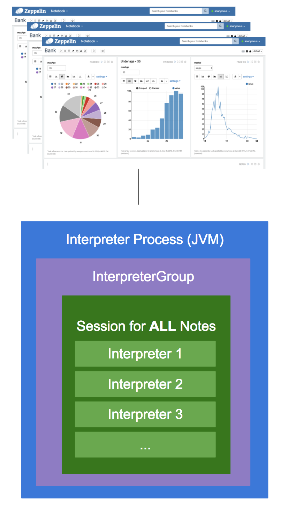
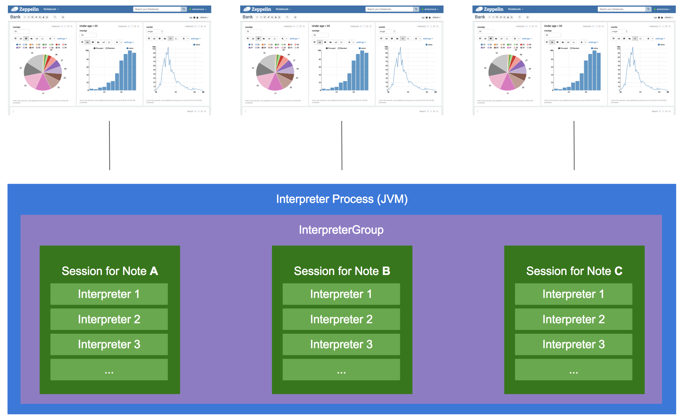
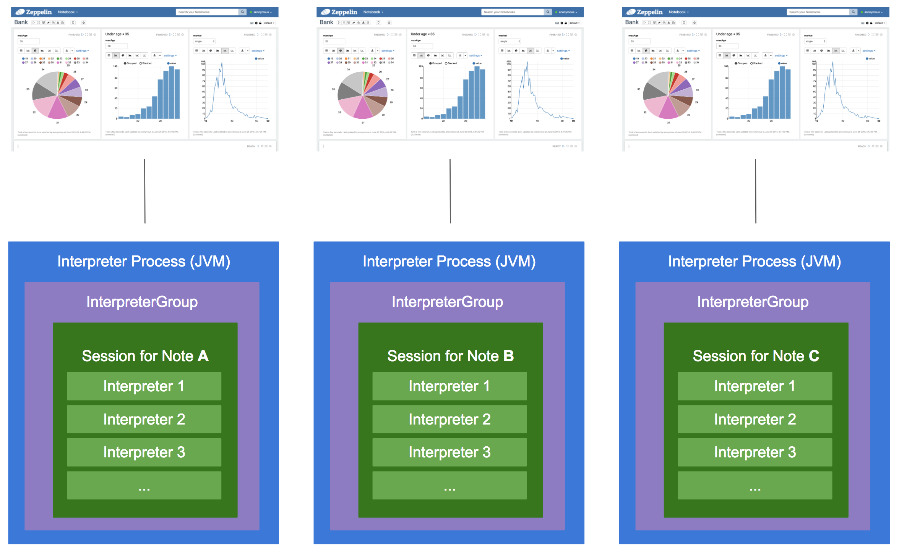
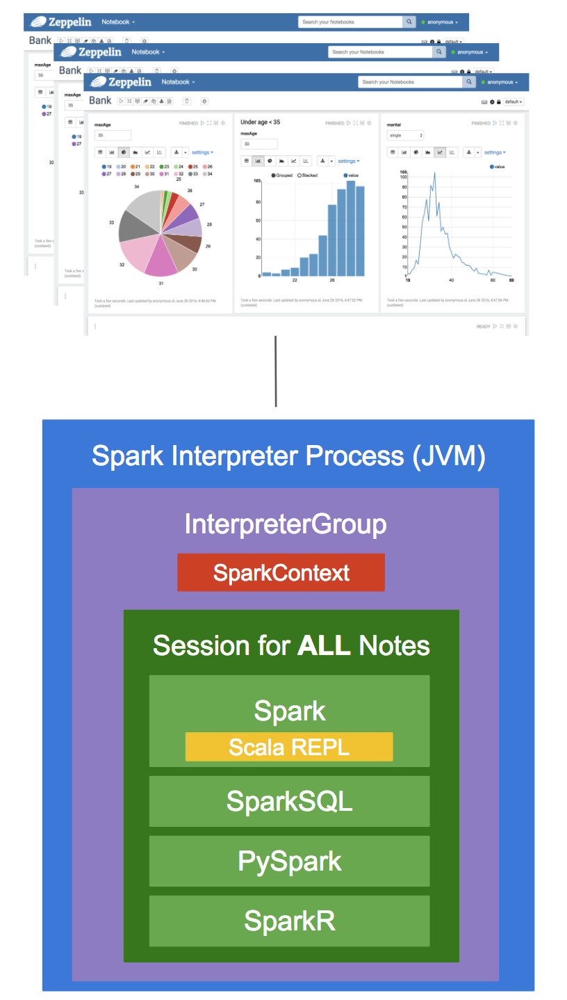
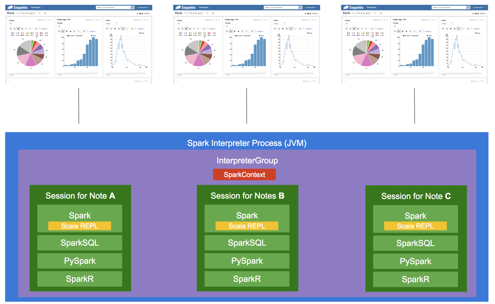
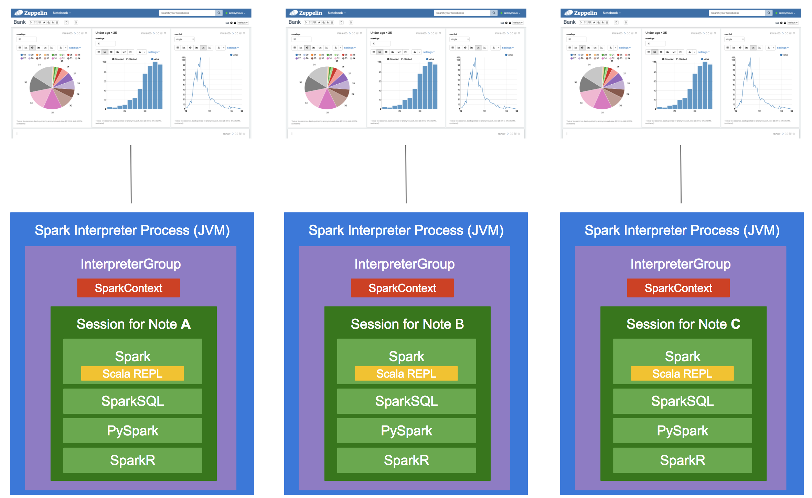

# [Interpreter Binding Mode](https://zeppelin.apache.org/docs/0.8.0/usage/interpreter/interpreter_binding_mode.html)
```md
Zeppelin提供3种不同的模式来运行解释器进程：shared, scoped and isolated。
用户可以指定这些模式的范围：每个用户或每个Note。这三种模式可以灵活地将Zeppelin安装到任何类型的用例中。
```

***Share Mode***
```md
绑定到解释器设置的每个笔记本将共享单个解释器实例。

在共享模式下，单个JVM进程和单个会话为所有Note提供服务。
因此，Note A 可以访问从其他 Note 直接创建的变量（例如python，scala，..）。
```

***Scoped Mode***
```md
每个笔记本将在同一个解释器进程中创建新的Interpreter实例。

在Scoped模式下，Zeppelin仍然运行单个解释器JVM进程，但是在每个Note范围的情况下，每个Note都在其自己的专用会话中运行。
（注意，仍然可以通过ResourcePool在这些Note之间共享对象）
```

***isolated Mode***
```md
在“隔离”模式下，每个Note都将创建新的Interpreter进程。

在每个Note范围下，隔离模式为每个Note运行单独的解释器过程。每个Note都有一个完全孤立的会话。
（但仍然可以通过ResourcePool共享对象）
```


## Which mode should I use?
<table border=0 cellpadding=0 cellspacing=0 width=696 style='border-collapse: 
 collapse;table-layout:fixed;width:522pt'>
  <col width=162 style='mso-width-source:userset;width:121pt'>
  <col width=100 style='width:75pt'>
  <col width=167 style='mso-width-source:userset;width:125pt'>
  <col width=267 style='mso-width-source:userset;width:200pt'>
  <tr height=21 style='mso-height-source:userset;height:16pt' id='r0'>
    <td height=21 class=x22 width=100 style='height:16pt;width:121.5pt;font-weight:bold;' >Mode</td>
    <td class=x22 width=380 style='width:500pt;font-weight:bold;'>Each notebook...</td>
    <td class=x22 width=380 style='width:525.25pt;font-weight:bold;' >Benefits</td>
    <td class=x22 width=380 style='width:500.25pt;font-weight:bold;' >Disadvantages</td>
    <td class=x22 width=380 style='width:500.25pt;font-weight:bold;' >Sharing objects</td>
  </tr>
  <tr height=21 style='mso-height-source:userset;height:16pt' id='r8'>
    <td class=x24>shared</td>
    <td class=x25>在单个解释器进程（JVM）中共享单个会话</td>
    <td class=x24>资源利用率低，在笔记本电脑之间轻松共享数据</td>
    <td class=x25>如果解释程序进程终止，所有Note都会受到影响</td>
    <td class=x25>可以直接分享</td>
  </tr>
    <tr height=21 style='mso-height-source:userset;height:16pt' id='r8'>
    <td class=x24>scoped</td>
    <td class=x25>在同一个解释器进程（JVM）中有自己的会话</td>
    <td class=x24>资源利用率低于隔离模式</td>
    <td class=x25>如果解释程序进程终止，所有Note都会受到影响</td>
    <td class=x25>无法直接共享，但可以通过ResourcePool共享</td>
  </tr>
    <tr height=21 style='mso-height-source:userset;height:16pt' id='r8'>
    <td class=x24>scoped</td>
    <td class=x25>有自己的解释器进程</td>
    <td class=x24>一台notebook受到其他notebook的影响</td>
    <td class=x25>无法轻松共享Note之间的数据</td>
    <td class=x25>无法直接共享，但可以通过ResourcePool共享对象</td>
  </tr>
</table>

```md
对于每用户范围（在多用户环境中可用），Zeppelin基于每个用户而不是每个Note来管理解释器会话。

例如：
In scoped + per user mode，用户A的Note可能会受到用户B的Note的影响。
（例如JVM死了，...）因为所有笔记都在同一个JVM上运行。

另一方面，isolated + per user mode，用户A的Note不会受到在隔离的JVM上运行的其他Note的影响。
```
```md
每个Interpreter实现可能具有不同的特性，具体取决于它们集成的后端系统。并且可以以不同方式使用3种解释器模式。

我们来看看Spark解释器实现如何在每个Note范围内使用这3种解释器模式作为示例。

Spark Interpreter
实现包括4个不同的解释器：Spark，SparkSQL，Pyspark和SparkR。
Spark Interpreter实例 嵌入Scala REPL以执行交互式Spark API。
```

```md
在共享模式下，组中的所有解释器之间共享 SparkContext 和 Scala REPL。
所以每个笔记都将共享单个 SparkContext 和单个 Scala REPL。
在这种模式下，如果Note A定义变量'a'，那么Note B不仅能够读取变量'a'而且能够覆盖变量。
```

```md
在Scoped模式下，每个Note都有自己的Scala REPL。因此，在Note中定义的变量不能在另一个Note中读取或覆盖。

但是，单个SparkContext仍然可以为所有会话提供服务。
并且所有作业都提交给此SparkContext，公平调度程序会安排作业。

当用户不想共享Scala会话，但希望保留单个Spark应用程序并利用其公平调度程序时，这可能很有用。
```

```md
在隔离模式下，每个音符都有自己的SparkContext和Scala REPL。
```