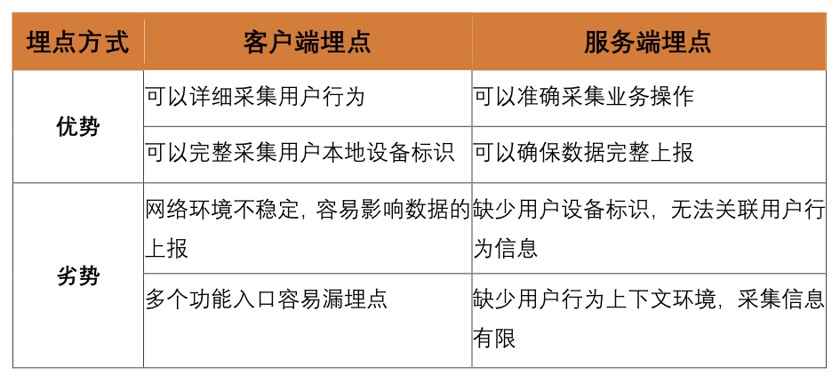

# 客户端/服务端埋点

## 客户端埋点
「打开商品详情页」、「加入购物车」、「提交订单」这 3 个事件均为客户端的用户行为，适合客户端埋点。
因为：
客户端可采集的å字段更丰富；
有利于关联用户设备标识与用户行为。

## 服务端埋点

对于「支付成功」这个业务结果事件，一般建议使用服务端埋点：
因为：
有利于排除客户端网络环境不稳定造成的数据误差。
如果客户端界面上有多个支付入口，使用服务端埋点可以确保各入口数据完整上报，而客户端埋点容易漏埋。

上述场景将客户端埋点与服务端埋点两种埋点方式相结合，互补各自的优劣势，达到数据的完整、准确、高效上报。

### 适用业务场景

1. 发生的入口比较多
2. 业务状态在客户端没有体现

## 比较

客户端埋点需要多个客户端（Android、iOS、PC）开发团队的埋点资源，而使用服务端埋点，则可以节省多个开发团队的沟通成本。

## 埋点方式

客户端埋点适用于用户界面行为的上报，服务端埋点适用于业务操作的上报。
以经典的「电商购买」业务流程为例：
打开详情页-》加入购物车-》提交订单-》支付成功
